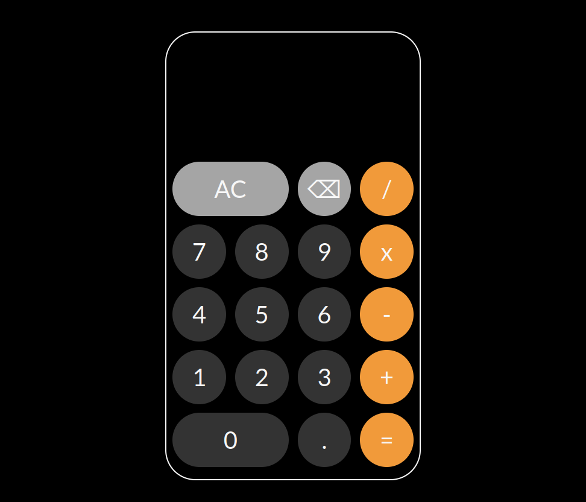

# Calculator
This is the calculator from the (amazing) [The Odin Project curriculum](https://www.theodinproject.com/).

It's a simple calculator based on the iOS calculator, with the ability to add, subtract, multiply and divide.
With keyboard support.

# Skills
### After completing it, I learned:
Adding Event Listeners.

Getting key presses from the user.

Better Flex box usage.
# Tech
### This project was made with:
[HTML]

[JS]

[CSS]
# Live Preview
See the page in the [Live Preview](https://pawys.github.io/Calculator/)
